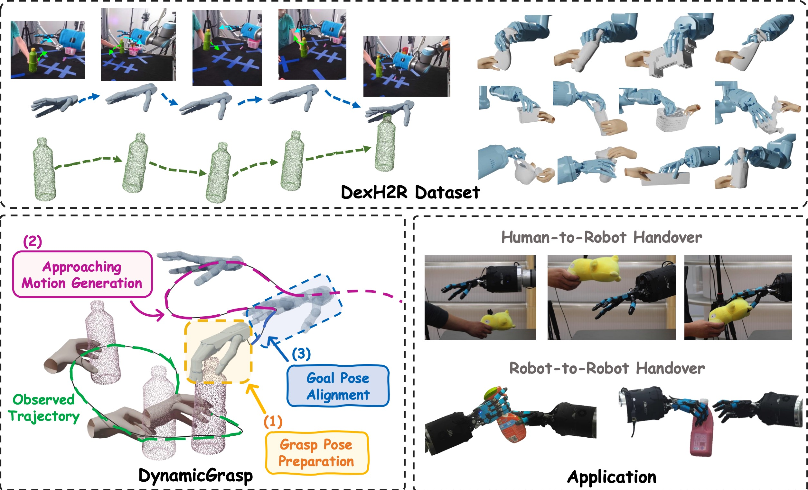

# DexH2R
Official code for "**DexH2R: A Benchmark for Dynamic Dexterous Grasping in Human-to-Robot Handover**" *(ICCV 2025)*
[Project Page](https://dexh2r.github.io/) | [Paper](https://arxiv.org/abs/2506.23152)





### CVAE for Grasp Pose Prepration and Motion Net for Approaching Motion Generation

Please see [README](https://github.com/wang-youzhuo/DexH2R/blob/main/GraspAndMotionet/README.md) in `GraspAndMotionet` folder.

### Diffusion Policy and Diffusion Policy 3d for Approaching Motion Generation

Please see [README]() in `DiffusionPolicy` folder.

### dataset


* Clone this repository:
```commandline
git clone git@github.com:wang-youzhuo/DexH2R.git
```
1. Create a `dataset` folder under `DexH2R`:
```commandline
mkdir data
```
2. Download the dataset from [here](https://drive.google.com/drive/folders/1dco6ooYR7BWh_ULDX-n5EKZ5FFaU_rVQ?usp=sharing), and put them under `dataset`. 

We divided the dataset into individual units, with all the data of each person stored in a single zip file. Each zip file contains all the data from 18 viewpoints across three types of cameras: Kinect, RealSense, and ZCam. Additionally, it includes the qpos of the shadow hand, human hand reconstruction results of the human subject, segmented and clustered point clouds of real-world objects, as well as the object poses at each time step. The detailed file directory structure of each zip file is as follows:

```commandline
DexH2R
├── GraspAndMotionet
├── DiffusionPolicy
└── dataset
    ├── DexH2R_dataset
    │   ├── 0(subject_name)
    │   │   ├── air_duster(object_name)
    │   │   │      ├── 0(sequence_index)
    │   │   │      │   ├── calibration
    │   │   │      │   ├── kinect
    │   │   │      │   ├── realsense
    │   │   │      │   ├── zcam
    │   │   │      │   ├── (right/left)_mano.pt
    │   │   │      │   ├── obj_pose.pt
    │   │   │      │   ├── qpos.pt
    │   │   │      │   ├── real_obj_pcd_color.pt
    │   │   │      │   └── real_obj_pcd_xyz.pt
    │   │   │      └── ...
    │   │   ├── bathroom_cleaner(object_name)
    │   │   └── ...
    │   │
    │   ├── 1(subject_name) 
    │   └── ...
    ├── object_model
    └── dataset_split.json
```

To save space, the storage format for all depth images is torch.int16. Please manually change its data type to numpy.uint16 to convert it to the normal format

Download obj_and_data_split.zip from [here](https://drive.google.com/file/d/1ybEs6ekTA8zsqayvy6Oho20ZUc5CNanL/view?usp=drive_link), unzip it in the dataset folder, this zip contains the objects' mesh models and dataset split information

Download shadow hand description.zip from [here](https://drive.google.com/file/d/1frZlH4_1m6d25OhsQzjkp4Y7FGbdGARK/view?usp=drive_link), unzip it in the GraspAndMotionet/assets 

You can visualize the dataset by GraspAndMotionet/viz_and_test_motion/viz_dataset.py

The camera extrinsic parameters folder, the content in the kinect folder, refers to the extrinsic parameters between kinect's camera 0 and other cameras. hand_arm_mesh_to_kinect_pcd_0 refers to the extrinsic parameters between the robotic hand's coordinate system and kinect's camera 0. realsense_to_forearm_index_0 refers to the coordinate transformation between realsense 0 and the shadow hand's forearm (because the realsense and forearm are relatively stationary), and the same applies to realsense_to_forearm_index_1. The file zcam_calibration.json specifies all the extrinsic parameter transformations between zcams, and zcam_to_kinect_transform specifies the coordinate transformation between zcam and kinect's camera 0. For all coordinate transformation relationships, please refer to the file GraspAndMotionet/viz_and_test_motion/viz_dataset.py to obtain specific usage.

## Citation

```
@article{wang2025dexh2r,
  title={DexH2R: A Benchmark for Dynamic Dexterous Grasping in Human-to-Robot Handover},
  author={Wang, Youzhuo and Ye, Jiayi and Xiao, Chuyang and Zhong, Yiming and Tao, Heng and Yu, Hang and Liu, Yumeng and Yu, Jingyi and Ma, Yuexin},
  journal={arXiv preprint arXiv: https://arxiv.org/abs/2506.23152},
  year={2025}
}
```

## License
This work and the dataset are licensed under [CC BY-NC 4.0][cc-by-nc].

[![CC BY-NC 4.0][cc-by-nc-image]][cc-by-nc]

[cc-by-nc]: https://creativecommons.org/licenses/by-nc/4.0/
[cc-by-nc-image]: https://licensebuttons.net/l/by-nc/4.0/88x31.png